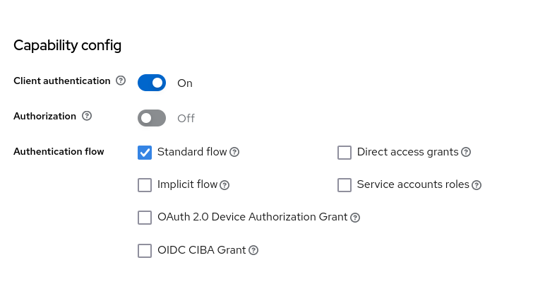
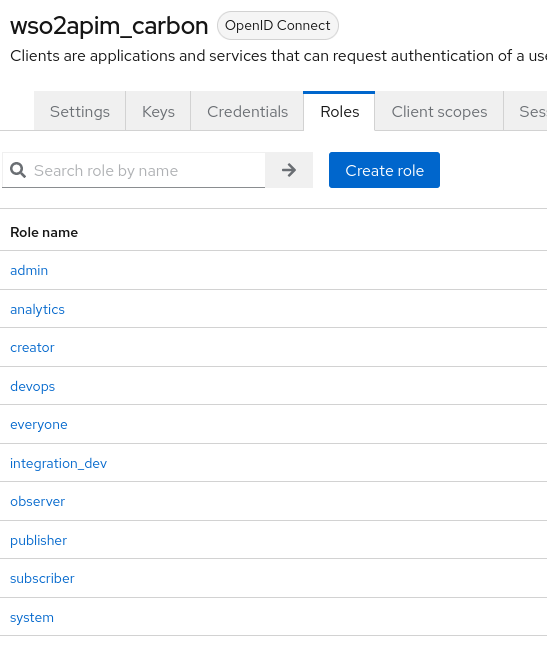
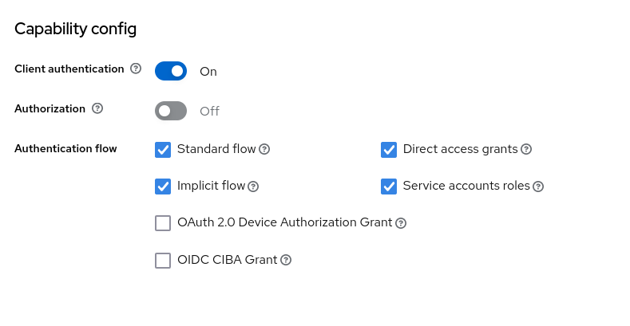
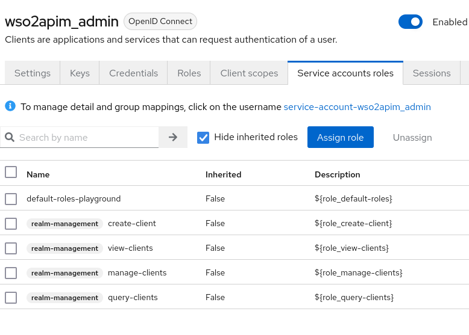
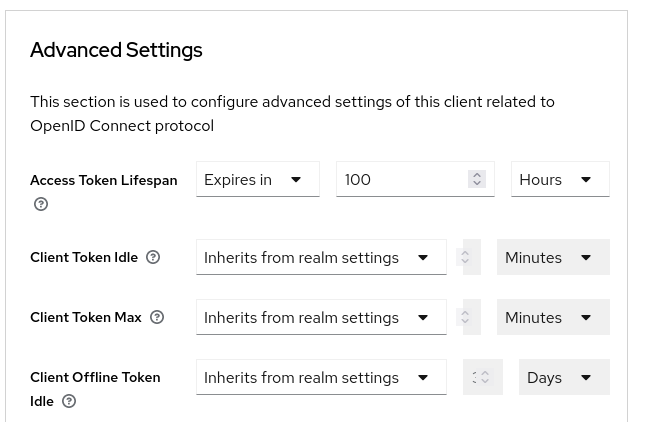

= WSO2 API Manager

Start by reading https://apim.docs.wso2.com/en/latest/reference/working-with-the-source-code/[Working with the Source Code] it will link
to https://wso2.github.io/github-repositories.html[Overview of the WSO2 repositories] and https://wso2.github.io/using-maven.html[Using Maven to Build WSO2 Products].

You might be tempted to use `mvn clean install -Dmaven.test.skip=true`, but at least one time go for `mvn clean install` to execute all the tests.

You can find the new binary pack (ZIP file) in the `<PRODUCT_REPOSITORY_HOME>/modules/distribution/target` directory, which you can use to distribute the product if needed.

TIP: Set the environment variable MAVEN_OPTS="-Xmx2048M -XX:MaxPermSize=1024m" to avoid the Maven OutOfMemoryError. Use JDK 11 to build.

.build carbon-apimgt
[source,bash]
----
mkdir -p $HOME/git
cd $HOME/git
git clone git@github.com:wso2/carbon-apimgt.git
cd carbon-apimgt
mvn clean install
----

.build product-apim
[source,bash]
----
mkdir -p $HOME/git
cd $HOME/git
git clone git@github.com:wso2/product-apim.git
cd product-apim
mvn clean install
----

TIP: Apache Ant is required to compile and run the sample clients for `product-apim`. Apache Ant 1.7.0 version is recommended

== WSO2 API Manager endpoints

- https://localhost:9443/publisher  / https://api.jarry.dk:9443/publisher
- https://localhost:9443/devportal  / https://api.jarry.dk:9443/devportal
- https://localhost:9443/carbon     / https://api.jarry.dk:9443/carbon
- https://localhost:9443/admin      / https://api.jarry.dk:9443/admin

== Install and config

- https://apim.docs.wso2.com/en/latest/administer/key-managers/configure-keycloak-connector/[Configure Keycloak as a Key Manager]
- https://apim.docs.wso2.com/en/latest/install-and-setup/install/installing-the-product/installing-api-m-as-a-linux-service/[Running API Manager as a Linux Service]
- https://apim.docs.wso2.com/en/latest/install-and-setup/setup/setting-up-databases/overview/[Working with Databases]
- https://apim.docs.wso2.com/en/latest/install-and-setup/setup/setting-up-databases/changing-default-databases/changing-to-postgresql/[Changing to PostgreSQL]

=== Changing to PostgreSQL

.Create the AM database
[source,sql]
----
CREATE USER apimadmin WITH PASSWORD 'playground';
CREATE DATABASE apim_db OWNER apimadmin;
grant all privileges on database apim_db to apimadmin;
----

.Add schema to apim_db
[source,bash]
----
APIM_HOME=/opt/wso2/wso2am-4.2.0
psql -U apimadmin -d apim_db -f $APIM_HOME/dbscripts/apimgt/postgresql.sql  -W
----

.Create the Shared database
[source,sql]
----
CREATE USER sharedadmin WITH PASSWORD 'playground';
CREATE DATABASE shared_db OWNER sharedadmin;
grant all privileges on database shared_db to sharedadmin;
----

.Add schema to shared_db
[source,bash]
----
APIM_HOME=/opt/wso2/wso2am-4.2.0
psql -U sharedadmin -d shared_db -f $APIM_HOME/dbscripts/postgresql.sql -W
----

.Download postgresql and add it to ../lib/
[source,bash]
----
APIM_HOME=/opt/wso2/wso2am-4.2.0
curl -o $APIM_HOME/repository/components/lib/postgresql-42.6.0.jar https://jdbc.postgresql.org/download/postgresql-42.6.0.jar
----

.Overwrite <API-M_HOME>/repository/conf/deployment.toml
[source,bash]
----
APIM_HOME=/opt/wso2/wso2am-4.2.0
cp -vf deployment.toml $APIM_HOME/repository/conf/deployment.toml
----

Alternative - Open the <API-M_HOME>/repository/conf/deployment.toml configuration file and locate the [database.shared_db] and [database.apim_db] configuration elements.

----
[database.apim_db]
type = "postgre"
url = "jdbc:postgresql://localhost:5432/apim_db"
username = "apimadmin"
password = "playground"
driver = "org.postgresql.Driver"
validationQuery = "SELECT 1"

[database.shared_db]
type = "postgre"
url = "jdbc:postgresql://localhost:5432/shared_db"
username = "sharedadmin"
password = "playground"
driver = "org.postgresql.Driver"
validationQuery = "SELECT 1"
----

=== Overwrite - enable_outbound_auth_header

Open the <API-M_HOME>/repository/conf/deployment.toml configuration file and locate the [apim.oauth_config] configuration elements.

Go from
----
#[apim.oauth_config]
#enable_outbound_auth_header = false
#auth_header = "Authorization"
#revoke_endpoint = "https://localhost:${https.nio.port}/revoke"
#enable_token_encryption = false
#enable_token_hashing = false
----

to
----
[apim.oauth_config]
enable_outbound_auth_header = true
#auth_header = "Authorization"
#revoke_endpoint = "https://localhost:${https.nio.port}/revoke"
#enable_token_encryption = false
#enable_token_hashing = false
----

Now the `Authorization` header will go all the way to the backend.

== Use Keycloak

I created two cliens one for Carbon (wso2apim_carbon) and one for Admin (wso2apim_admin) to use.

=== Client : wso2apim_carbon

.Name
`wso2apim_carbon`

.Capability config

.Roles

All the roles have a one to one mapping in WSO2.

=== Client : wso2apim_admin

.Name
`wso2apim_admin`

.Capability config

.Service account roles

.Advanced Settings

The value for `Access Token Lifespa` have been changed to 100 hours.

=== Configure Service Providers in Carbon to use Keyclaok

I used the blog https://athiththan11.medium.com/wso2-api-manager-3-2-keycloak-oidc-sso-7009ce903589[WSO2 API Manager 3.2 & Keycloak (OIDC) SSO] to do the configuation.
You can do a login to https://localhost:9443/publicer, https://localhost:9443/devportal, and https://localhost:9443/admin to get the default config.

=== Configure Keycloak in admin

https://stackoverflow.com/questions/69582133/wso2-api-manager-with-keycloak-using-other-realm-than-master#69583958

=== Links
- https://apim.docs.wso2.com/en/latest/administer/key-managers/configure-keycloak-connector/[Configure Keycloak as a Key Manager]
- https://himashaguruge.medium.com/using-keycloak-as-an-external-idp-with-wso2-api-manager-3-1-0-7f7a3a637526[Using Keycloak as an external IDP with WSO2 API Manager 3.1.0]
- https://athiththan11.medium.com/wso2-api-manager-3-2-keycloak-oidc-sso-7009ce903589[WSO2 API Manager 3.2 & Keycloak (OIDC) SSO]
- https://www.chakray.com/how-use-keycloak-as-wso2-api-manager-identity-provider/[How to use Keycloak as a WSO2 API Manager Identity Provider]
- https://www.yenlo.com/blogs/keycloak-third-party-key-manager-wso2-apim-2/[Keycloak as a third-party Key Manager for WSO2 API Manager]
- https://dzone.com/articles/sso-wso2-api-manager-amp-keycloak[SSO — WSO2 API Manager and Keycloak]

== Ldap

Ldap servers -> https://en.wikipedia.org/wiki/List_of_LDAP_software[List of LDAP software - from wikipedia]

Use `https://jumpcloud.com/blog/choosing-ldap-server[Choosing the Right LDAP Server]` or `https://medium.com/geekculture/the-only-guide-you-need-to-get-started-with-ldap-6f526385934f[The only guide you need to get started with LDAP]` to get inspiration to pick Ldap server.

- https://azure.microsoft.com/en-us/products/active-directory/[Microsoft Azure Active Directory Server]
- https://directory.apache.org[Apache Directory Server]
- https://www.openldap.org[OpenLDPA]
- https://directory.fedoraproject.org/[389 Directory Server]
- https://www.freeipa.org/page/Main_Page[FreeIPA]

https://www.saashub.com/compare-apacheds-vs-openldap?ref=compare[Compare Apache Directory vs OpenLDAP]

=== Microsoft Azure Active Directory Server

----
Azure Active Directory Domain Services (Azure AD DS) provides managed domain services such as domain join, group policy, lightweight directory access protocol (LDAP), and Kerberos/NTLM authentication. You use these domain services without the need to deploy, manage, and patch domain controllers (DCs) in the cloud.

An Azure AD DS managed domain lets you run legacy applications in the cloud that can't use modern authentication methods, or where you don't want directory lookups to always go back to an on-premises AD DS environment. You can lift and shift those legacy applications from your on-premises environment into a managed domain, without needing to manage the AD DS environment in the cloud.

Azure AD DS integrates with your existing Azure AD tenant. This integration lets users sign in to services and applications connected to the managed domain using their existing credentials. You can also use existing groups and user accounts to secure access to resources. These features provide a smoother lift-and-shift of on-premises resources to Azure.
----
Source: https://learn.microsoft.com/en-us/azure/active-directory-domain-services/overview

TIP: Have a look at https://azure.microsoft.com/en-us/pricing/details/active-directory/[Azure Active Directory (Azure AD) pricing] before going with this option

==== Links

- https://www.youtube.com/watch?v=LYF-NLHD2uQ
- https://learn.microsoft.com/en-us/answers/questions/270527/how-to-map-import-users-from-azure-to-keycloak-(-w
    * https://playbook.stakater.com/content/workshop/aad-in-openshift.html[Adding Azure Active Directory Users to KeyCloak]
    * https://suryaprakash-pandey.medium.com/azure-ad-idp-with-keycloak-as-sp-1ca933d71388#
    * https://stackoverflow.com/questions/54823058/keycloak-integration-with-azure-ad-for-webapp-authentication
- https://blog.hcltechsw.com/versionvault/how-to-configure-microsoft-azure-active-directory-as-keycloak-identity-provider-to-enable-single-sign-on-for-hcl-compass/
- https://azure.microsoft.com/en-us/pricing/details/active-directory/

=== Apache Directory Server

----
ApacheDS is focused on being a little easier to install, configure, and manage. The accompanying Apache Directory Studio suite of tools is there for IT admins to more easily implement ApacheDS. The UI tools include an LDAP schema editor, LDAP browser, LDIF editor, access control editor, and more. The ApacheDS and associated tools have largely been written in Java.

A core distinction that Apache Directory Server has when compared to OpenLDAP and other LDAP-based, open-source solutions has been that ApacheDS has introduced stored procedures and triggers to help make database maintenance and the process of managing the database a little stronger.
----
Source: https://jumpcloud.com/blog/apache-directory-server[What is Apache Directory™ Server? – ApacheDS]

=== OpenLDAP

----
OpenLDAP is command-line driven software that allows IT admins to build and manage an LDAP directory. Due to its minimal UI and reliance on the CLI, it requires an in-depth knowledge of the LDAP protocol and directory structure.
----
Source : https://jumpcloud.com/blog/what-is-openldap[What Is OpenLDAP?]

==== Links

- https://www.openldap.org/doc/admin26/quickstart.html[A Quick-Start Guide]

=== 389 Directory Server

----
Yet another incarnation of LDAP, 389 Directory Server, run by RedHat, is focused on being a reasonably high-performance version of the protocol. 389 Directory Server is open source and shares many similarities with OpenLDAP. And, like OpenLDAP, it works best with Linux and requires significant technical knowledge to implement and manage.
----
Source: https://jumpcloud.com/blog/choosing-ldap-server

==== Links

- https://www.linkedin.com/pulse/getting-started-open-source-identity-access-keycloak-sureshkumar[Getting Started with Open Source Identity Access Management (Keycloak) and Open Source Directory Service (389 Directory Server)]
- https://awslife.medium.com/configuration-the-keycloak-server-for-sso-single-sign-on-for-a-lab-environment-2-428dc878ba3e[Configuration the keycloak server for SSO(Single-Sign-On) for a lab environment (2)]

=== FreeIPA

----
FreeIPA is focused on managing Linux users and hosts. FreeIPA is a combination of LDAP, Kerberos, DNS, and more. However, FreeIPA is rarely used on its own. Much like Samba, FreeIPA is often leveraged in conjunction with Active Directory or other IAM solutions. So, FreeIPA doesn’t have a reputation for being a standalone directory service.
----
Source: https://jumpcloud.com/blog/open-source-active-directory

=== Config of Ldap - WSO2 and Keycloak

- https://apim.docs.wso2.com/en/latest/reference/connectors/ldap-connector/setting-up-ldap/[Setting up an LDAP Server]
- https://apim.docs.wso2.com/en/latest/administer/managing-users-and-roles/managing-user-stores/configure-primary-user-store/configuring-a-read-write-active-directory-user-store/#properties-used-in-read-write-active-directory-user-store[Configure a Read-Write Active Directory User Store]
- https://www.keycloak.org/docs/latest/server_admin/index.html#_ldap

== Links

- https://apim.docs.wso2.com/en/latest/[API Manager Documentation]
- https://apim.docs.wso2.com/en/latest/reference/working-with-the-source-code/
- https://wso2.github.io/github-repositories.html
- https://wso2.github.io/using-maven.html
- https://github.com/wso2/carbon-apimgt
- https://github.com/wso2/product-apim
- https://github.com/wso2/product-apim/releases/tag/v4.2.0
- https://github.com/wso2/docker-apim/blob/4.2.x/dockerfiles/jdk11/ubuntu/apim/Dockerfile

